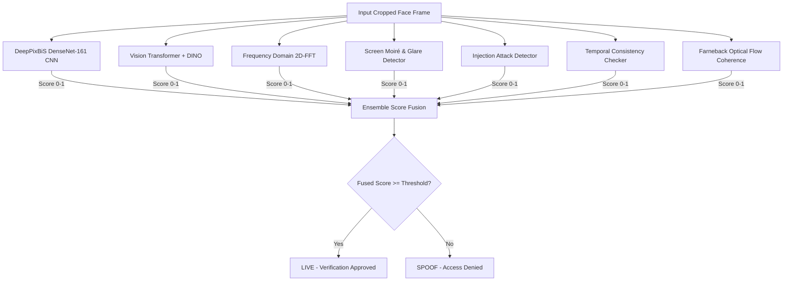

# 03. Multi-Modal Anti-Spoofing & Liveness Detection

## 1. Threat Taxonomy & ISO/IEC 30107-3 Attack Presentation

Presentation attacks target biometric verification by spoofing genuine facial traits. The system protects against five major attack presentation classes:

| Attack Category | Physical Mechanism | Target Artifacts | Defense Mechanism |
| :--- | :--- | :--- | :--- |
| **Print Attacks (2D)** | Printed photograph on matte/glossy paper | Lack of high-frequency texture, flat depth, specular reflections | 2D-FFT spectrum, DeepPixBiS pixel map, Stereo depth |
| **Replay Attacks (2D Screen)** | Video played on smartphone, tablet, or monitor | Moiré patterns, screen refresh rate, bezel edges, unnatural color gamut | Static Image Detector, 2D-FFT block compression, motion coherence |
| **3D Mask Attacks** | Latex, silicone, or hard resin masks | Rigid surface, lack of micro-expressions, unnatural heat/reflection | Farneback optical flow, Active Flash reflection, MediaPipe FaceMesh |
| **Deepfakes & Generative AI** | GAN / Diffusion-generated face replacement | Frequency inconsistencies, boundary blending artifacts, unnatural eye blinking | ViT-DINO transformer backbone, Enhanced Blink Detector |
| **Virtual Injection Attacks** | Software emulator feeding video directly to camera driver | Invariant PRNU sensor noise, lack of natural hand tremor jitter | Injection Attack Detector (sensor PRNU & frame timing jitter) |

---

## 2. Multi-Modal Ensemble Architecture

The anti-spoofing engine fuses complementary detection signals into a unified confidence score:

---

## 3. Deep Learning Anti-Spoofing Models

### 3.1 DeepPixBiS (Deep Pixel-wise Binary Supervision)
Defined in `Model.py`, DeepPixBiS is built upon a DenseNet-161 feature extractor:
- **Feature Encoder**: The first 8 convolutional blocks of DenseNet-161 extract multi-scale spatial features.
- **Pixel-wise Supervision**: A 1x1 2D convolution (`Conv2d(384, 1, kernel_size=1)`) projects the feature map to a $14 \times 14$ spatial liveness map:
  $$\mathbf{M}_{\text{pixel}} = \sigma(\text{Conv}_{1\times 1}(\mathbf{F})) \in [0, 1]^{14 \times 14}$$
  - For genuine faces, every cell of the map should ideally be $1.0$.
  - For spoof attacks, specific regions (e.g. paper borders, glare, flat textures) yield localized zero values.
- **Global Binary Head**: A linear classification layer maps the flattened $14 \times 14$ map to a scalar probability:
  $$s_{\text{global}} = \sigma(\mathbf{W} \cdot \text{vec}(\mathbf{M}_{\text{pixel}}) + b)$$
- **Combined Score**: The liveness score combines mean pixel liveness and global scalar prediction:
  $$s_{\text{CNN}} = 0.5 \cdot \text{mean}(\mathbf{M}_{\text{pixel}}) + 0.5 \cdot s_{\text{global}}$$

### 3.2 Vision Transformer with DINO (`Model_ViT.py`)
To neutralize state-of-the-art generative deepfakes, the system introduces a Vision Transformer architecture:
- **Backbone**: `vit_base_patch16_224.dino` (Self-Supervised DINO pretraining captures fine-grained texture representations).
- **Multi-Scale Convolutional Projection**: Converts 768-D patch embeddings back into spatial dimensions ($14 \times 14$).
- **Spatial Attention Module**: Highlights subtle artifact regions often overlooked by CNNs.
- **Frequency Analysis Subnetwork**: Directly learns frequency-domain anomaly patterns.

---

## 4. Signal Processing & Heuristic Analyzers

### 4.1 2D Fast Fourier Transform (FFT) Analysis (`FrequencyDomainAnalyzer`)
Implemented in `enhanced_liveness_utils.py`, this analyzer converts grayscale frames to the frequency domain via 2D Fast Fourier Transform:
$$F(u, v) = \sum_{x=0}^{M-1} \sum_{y=0}^{N-1} f(x, y) e^{-j 2\pi (\frac{ux}{M} + \frac{vy}{N})}$$

The magnitude spectrum $|F(u, v)|$ is evaluated across five indicators:
1. **High-Frequency Energy Ratio**: Natural human skin exhibits a characteristic balance of fine pores and soft tonal gradations. Photos reprinted on paper or rendered on digital screens show extreme high-frequency truncation ($< 0.10$) or artificial noise amplification ($> 0.60$).
2. **JPEG Periodic Compression Artifacts**: Checks for periodic peaks in 8x8 block boundaries typical of digital replay files.
3. **Local Variance Noise Analysis**: Real camera sensors produce Gaussian-distributed photon noise; synthetic faces are either unnaturally smooth (std < 5) or excessively noisy (std > 200).
4. **Spectral Entropy**: Quantifies structural disorder in the frequency distribution.
5. **Edge Consistency Ratio**: Measures edge sharpness against internal facial structure.

### 4.2 Static Image & Screen Moiré Detection (`StaticImageDetector`)
Distinguishes live humans from physical printouts and digital displays:
- **Moiré Pattern Detection**: High-frequency grid interference patterns formed by the interaction between camera sensors and display pixel matrices.
- **Screen Glare & Specular Reflection**: High-luminance, low-saturation specular patches with sharp boundaries.
- **Color Gamut Analysis**: Compares RGB channel histograms against natural skin tone ranges in YCrCb and HSV color spaces.
- **EXIF Metadata Inspection**: Flags software manipulation, editing tags, or missing camera hardware headers.

### 4.3 Virtual Injection & Emulator Detection (`InjectionAttackDetector`)
Attackers using rooted devices or emulators often hijack camera inputs using tools like OBS Virtual Cam, LDPlayer, or Frida hooks.
- **PRNU (Photo-Response Non-Uniformity)**: Real physical sensors possess microscopic silicon imperfections that imprint a deterministic noise fingerprint across frames. Injected digital video files lack this sensor signature.
- **Frame Timestamp Jitter**: Physical USB and mobile MIPI cameras exhibit small microsecond inter-frame timestamp fluctuations ($1–5\%$ jitter). Injected software feeds exhibit either perfectly fixed intervals (0 jitter) or massive sporadic spikes.

### 4.4 Motion Coherence Analysis (`motion_analysis.py`)
Computes dense optical flow across consecutive frames using the Gunnar Farneback algorithm:
- **Motion Magnitude Variance**: Genuine users present micro-motions (breathing, micro-saccades, subtle head drift). Static photos mounted on sticks or looped videos exhibit either near-zero variance ($< 0.01$) or repetitive periodic motion.
- **Directional Variance**: Natural movement shows subtle angular dispersion across facial feature vectors.
- **Video Loop Detection**: Computes 3D color histogram correlation across frames. High average similarity ($> 0.95$) coupled with near-zero standard deviation ($< 0.05$) flags a repeating looped replay.

---

## 5. Mathematical Ensemble Fusion

The final liveness score is determined by a weighted linear combination of all active signals:

$$S_{\text{final}} = \sum_{i} w_i \cdot s_i$$

Where default weights from `liveness_config.yaml` are:
- $w_{\text{model}} = 0.35$ (DeepPixBiS CNN / ViT)
- $w_{\text{frequency}} = 0.25$ (2D-FFT Spectral Analysis)
- $w_{\text{temporal}} = 0.20$ (Temporal & Motion Consistency)
- $w_{\text{blink}} = 0.10$ (Blink Pattern & Dynamics)
- $w_{\text{static}} = 0.10$ (Static / Screen Glare Analysis)

### Decision Logic:
- If $S_{\text{final}} \ge 0.75$ and at least 4 of 5 signals pass $\rightarrow$ **LIVE**
- Single Static Image Penalty: If only 1 frame is provided without temporal context, a $+0.15$ threshold penalty is applied ($0.90$ threshold), effectively blocking single-frame static photos.
