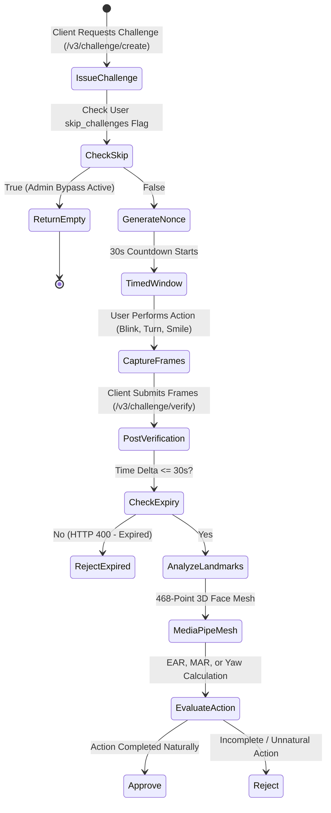

# 04. Interactive Challenge-Response System

## 1. Architectural Overview

Passive liveness detection (analyzing texture and frequencies) can be vulnerable to high-resolution generative AI video synthesis or sophisticated robotic replays. The **Interactive Challenge-Response System** (`face_challenge.py`) introduces active physiological challenges that require real-time human consciousness and physical reaction within strict temporal deadlines.



---

## 2. Challenge Types & Biomechanical Models

The system implements five randomized physiological challenges:

| Challenge Type | Instruction Prompt | Biomechanical Feature | Primary Landmark IDs | Decision Threshold |
| :--- | :--- | :--- | :--- | :--- |
| `blink` | *"Please blink 2-3 times"* | Eye Aspect Ratio (EAR) | Left: 362, 385, 387, 263, 373, 380<br>Right: 33, 160, 158, 133, 153, 144 | $\text{EAR} < 0.23$ (Dips below and recovers) |
| `smile` | *"Please smile naturally"* | Mouth Width / Inter-ocular Ratio | Mouth corners: 61, 291<br>Pupil centers: 468, 473 | Lip width expansion $\ge 15\%$ |
| `head_turn_left` | *"Turn your head slowly to the left"* | Head Yaw Angle ($\Delta X$) | Nose tip: 1, Left tragus: 234, Right tragus: 454 | $\text{Yaw} < -15^\circ$ (Relative to neutral) |
| `head_turn_right` | *"Turn your head slowly to the right"* | Head Yaw Angle ($\Delta X$) | Nose tip: 1, Left tragus: 234, Right tragus: 454 | $\text{Yaw} > +15^\circ$ (Relative to neutral) |
| `open_mouth` | *"Please open your mouth wide"* | Mouth Aspect Ratio (MAR) | Upper lip: 13, Lower lip: 14, Corners: 78, 308 | $\text{MAR} \ge 0.60$ |

---

## 3. Mathematical Feature Formulations

### 3.1 Eye Aspect Ratio (EAR)
Eye closure dynamics are tracked using the Soukupová and Čech metric:
$$\text{EAR} = \frac{\|p_2 - p_6\| + \|p_3 - p_5\|}{2 \|p_1 - p_4\|}$$
- When the eye is fully open, $\text{EAR} \approx 0.28 - 0.35$.
- During a full blink closure, $\text{EAR}$ plummets below $0.20$.
- To prevent replay attacks, the algorithm requires an oscillation pattern: the EAR must drop below $0.23$ and subsequently recover within $100 - 400$ ms.

### 3.2 Mouth Aspect Ratio (MAR)
Mouth opening is quantified in `mouth_detection.py` using vertical and horizontal lip distances:
$$\text{MAR} = \frac{\|p_{13} - p_{14}\|}{\|p_{78} - p_{308}\|}$$
- Neutral / closed mouth: $\text{MAR} < 0.25$.
- Wide mouth opening: $\text{MAR} \ge 0.60$.

### 3.3 Head Turn Yaw Estimation
MediaPipe 3D landmark coordinates ($x, y, z$) compute head rotation:
$$\text{Symmetry Ratio} = \frac{\|p_{\text{nose}} - p_{\text{left\_ear}}\|}{\|p_{\text{nose}} - p_{\text{right\_ear}}\|}$$
A natural head turn produces a dynamic shift in horizontal distance between the nasal tip and lateral facial margins exceeding the $15^\circ$ threshold.

---

## 4. Multi-Challenge Sequences (`create_challenge_sequence`)

For enhanced security scenarios (configurable in high-security profiles), the system issues a **random sequence of 2 or 3 distinct challenges** (e.g. `[head_turn_left, blink, open_mouth]`):
- Each challenge receives an individual cryptographic `challenge_id`.
- The sequence is tied to a common `sequence_id` and `session_id`.
- Frames captured during verification are segmented across the active challenges, requiring all challenges in the sequence to pass.

---

## 5. Admin Bypass Mechanism (`skip_challenges`)

To support automated end-to-end testing, rapid developer workflows, or accessibility exemptions:
1. Administrators can toggle challenge skipping per user via:
   `PATCH /admin/users/<username>/skip-challenges` with `{"skip_challenges": true}`
2. **Behavior on Challenge Creation**:
   When `/v3/challenge/create` is called with the user's username, the system queries PostgreSQL. If `skip_challenges` is active, it returns:
   ```json
   {
     "challenges": [],
     "session_id": "sess_...",
     "skip_challenges": true,
     "message": "Challenge skipping enabled for this user"
   }
   ```
3. **Behavior on Unified Verification**:
   In `/v3/verify/unified`, if the user has challenge skipping enabled, the pipeline awards an automatic full score ($1.0$) for the challenge component without penalizing overall verification confidence.
