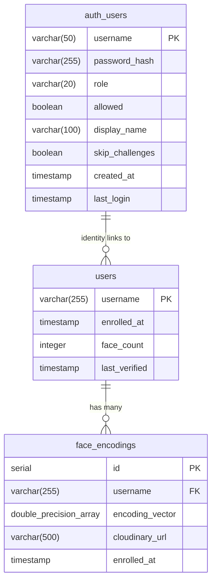

# 06. Database Architecture & Storage Infrastructure

## 1. Storage Architecture Overview

The system employs a decoupled, hybrid cloud persistence strategy:
- **Relational Metadata & Embeddings**: Stored in a PostgreSQL database hosted on Render, optimized for relational consistency and fast vector retrieval.
- **Biometric Media Assets**: Stored and transformed on Cloudinary's global content delivery network (CDN), avoiding local container disk bloat.



---

## 2. PostgreSQL Schema & Data Dictionaries

### 2.1 Table: `auth_users`
Stores user credentials, access control flags, and authentication status.

| Column | Type | Constraints | Description |
| :--- | :--- | :--- | :--- |
| `username` | `VARCHAR(50)` | `PRIMARY KEY` | Unique account login username |
| `password_hash` | `VARCHAR(255)` | `NOT NULL` | PBKDF2:SHA256 password hash |
| `role` | `VARCHAR(20)` | `DEFAULT 'user' NOT NULL` | Access tier: `'user'` or `'admin'` |
| `allowed` | `BOOLEAN` | `DEFAULT TRUE NOT NULL` | Account active flag (`FALSE` blocks access) |
| `display_name` | `VARCHAR(100)` | `NULL` | Friendly user profile name |
| `skip_challenges` | `BOOLEAN` | `DEFAULT FALSE NOT NULL` | Admin toggle to bypass active challenges |
| `created_at` | `TIMESTAMP` | `DEFAULT CURRENT_TIMESTAMP NOT NULL` | Account creation timestamp |
| `last_login` | `TIMESTAMP` | `NULL` | Most recent successful login timestamp |

---

### 2.2 Table: `users`
Tracks enrollment metadata and verification recency for biometric identities.

| Column | Type | Constraints | Description |
| :--- | :--- | :--- | :--- |
| `username` | `VARCHAR(255)` | `PRIMARY KEY` | Enrolled biometric username |
| `enrolled_at` | `TIMESTAMP` | `DEFAULT CURRENT_TIMESTAMP` | Initial face enrollment timestamp |
| `face_count` | `INTEGER` | `DEFAULT 0` | Total number of enrolled face templates |
| `last_verified` | `TIMESTAMP` | `DEFAULT CURRENT_TIMESTAMP` | Last successful face authentication |

---

### 2.3 Table: `face_encodings`
Stores the high-dimensional biometric vectors and links to source imagery.

| Column | Type | Constraints | Description |
| :--- | :--- | :--- | :--- |
| `id` | `SERIAL` | `PRIMARY KEY` | Surrogate template identifier |
| `username` | `VARCHAR(255)` | `REFERENCES users(username) ON DELETE CASCADE` | Owner identity |
| `encoding_vector` | `DOUBLE PRECISION[]` | `NOT NULL` | Array of 128 floating-point values representing facial metrics |
| `cloudinary_url` | `VARCHAR(500)` | `NULL` | Secure HTTPS URL to Cloudinary media |
| `enrolled_at` | `TIMESTAMP` | `DEFAULT CURRENT_TIMESTAMP` | Template creation timestamp |

**Indexes**:
```sql
CREATE INDEX IF NOT EXISTS idx_face_encodings_username 
ON face_encodings(username);
```

---

## 3. Serverless On-Demand Connection Lifecycle

Cloud PaaS environments like Render spin down free-tier instances after 15 minutes of inactivity. Persistent connection pools often suffer from broken socket errors (`psycopg2.OperationalError: server closed the connection unexpectedly`).

To ensure 100% resilience against cold starts and sleeping databases, `DatabaseManager` (`database_utils.py`) operates an **on-demand connection pattern**:

```python
def _get_connection(self):
    # Obtain a fresh connection per transaction
    if not self.connection_string:
        return None
    try:
        return psycopg2.connect(self.connection_string)
    except Exception as e:
        print(f"[!] Database connection failed: {e}")
        return None

def _close_connection(self, conn):
    # Safely close connection and release socket
    if conn:
        try:
            conn.close()
        except Exception:
            pass
```

Each transactional helper (`get_user_encodings`, `enroll_user`, `get_auth_user`) opens a short-lived connection, performs parameterized queries with `RealDictCursor`, commits or rolls back, and guarantees closure in a `finally` block.

---

## 4. Automated Schema Migrations

Upon instantiation, `DatabaseManager.create_tables()` automatically inspects PostgreSQL catalog metadata and executes safe idempotent migrations:
1. Adds `face_count` to `users` if absent.
2. Adds `last_verified` to `users` if absent.
3. Drops legacy authentication columns (`password_hash`, `role`, `allowed`) from `users` if previously mixed into the biometrics table.
4. Adds `skip_challenges` to `auth_users` if absent.

---

## 5. Cloudinary Media CDN Architecture

The `CloudinaryManager` (`cloudinary_utils.py`) manages asset storage, delivery, and deletion:

### 5.1 Upload Optimization Policy
Images uploaded during enrollment are processed with strict constraints:
- **Folder**: `face_recognition/faces/{username}/`
- **Naming Convention**: `{timestamp}_{index}.jpg`
- **Dimensions**: Constrained to a bounding box of 800x800 pixels (`crop: "limit"`).
- **Quality**: `quality: "auto"` activates Cloudinary's perceptual compression algorithm, reducing payload size while preserving edge fidelity.

### 5.2 Thread-Safe Parallel Upload Pipeline
During enrollment, multiple frames are uploaded concurrently using a thread pool:
```python
with ThreadPoolExecutor(max_workers=5) as executor:
    future_to_frame = {executor.submit(upload_frame, data): data for data in frames_data}
    for future in as_completed(future_to_frame):
        result = future.result()
        if result:
            encoding, url, index = result
            face_encodings.append(encoding)
            cloudinary_urls.append(url)
```

---

## 6. Database Initialization Utility (`init_auth_db.py`)

The standalone CLI utility `init_auth_db.py` bootstraps new deployments:
```bash
python init_auth_db.py
```
This utility:
1. Verifies `DATABASE_URL` connectivity.
2. Runs all DDL table creation statements.
3. Prompts the operator to create a root administrative user with a securely hashed password.
